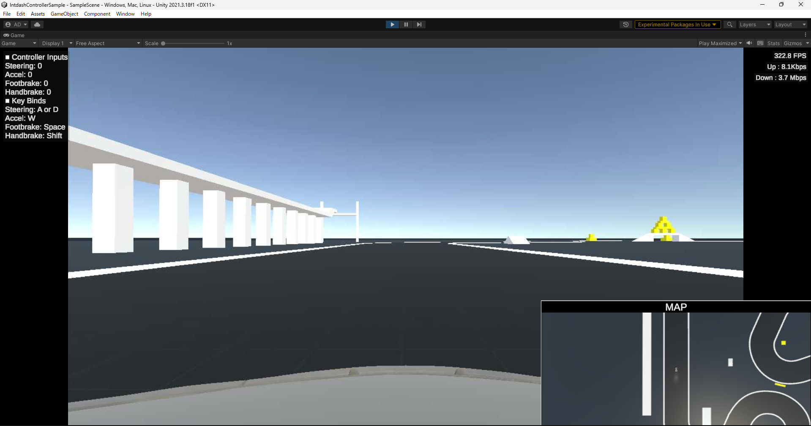
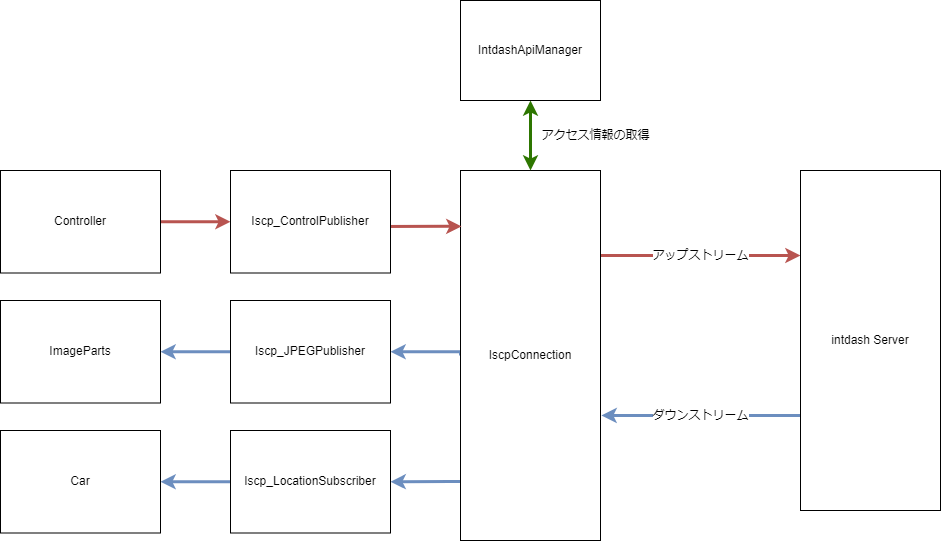
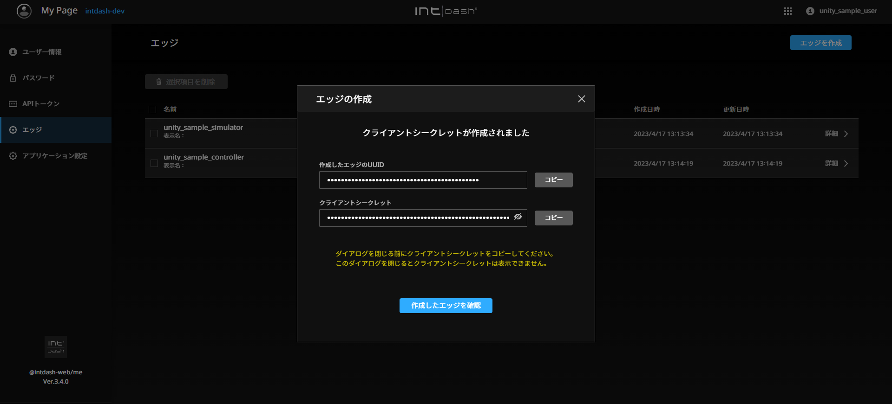
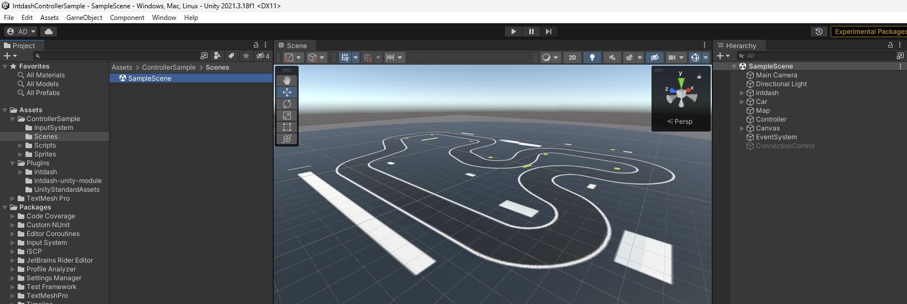
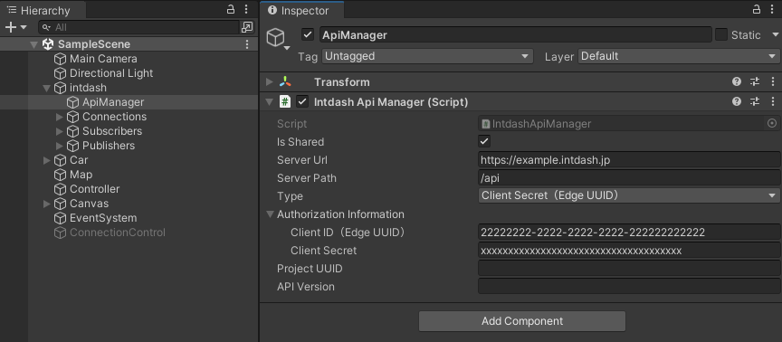
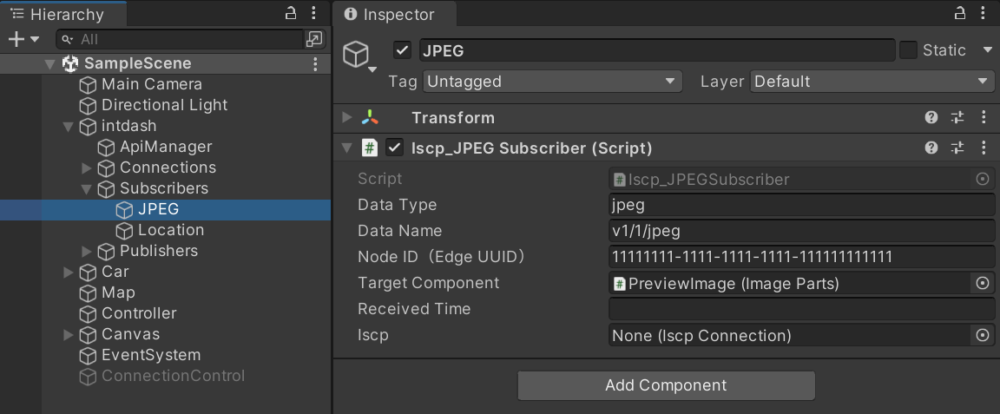
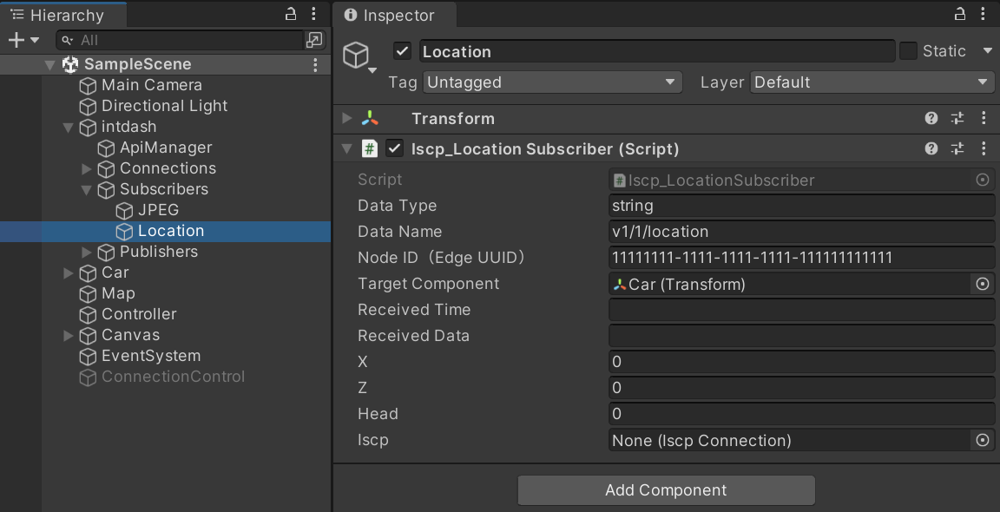
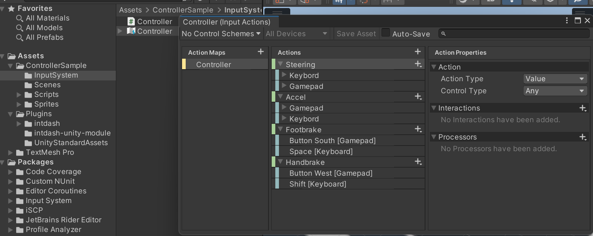

# intdash Controller Sample

intdashを利用して遠隔制御を行うコントローラーのサンプルです。

このサンプルでは、同梱されているintdash Simulator Sampleに設置された車モデルを動かすことが可能です。

シミュレーターから送信される映像と位置情報も可視化されるので、シミュレーターの状況を把握しながら操作することが可能です。

コントローラーサンプルのデータフローは以下のとおりです。

## サンプルの動かし方

### 1. intdashサーバーとアクセス情報を用意する

- 接続先intdashサーバーのURL（例: https://example.intdash.jp ）
- Controllerに設定するエッジの認証情報
    - UUID（例: 22222222-2222-2222-2222-222222222222）
    - クライアントシークレット または APIトークン
- Simulator内の車オブジェクトのエッジUUID（例: 11111111-1111-1111-1111-111111111111）

サーバーとの接続にはクライアントシークレットまたはAPIトークンが必要です。

このサンプルではクライアントシークレットを利用します。

クライアントシークレットは、My Pageアプリ（例: `https://example.intdash.jp/users/me/`）でエッジを作成した際に発行されます。

詳細は [intdash / Visual M2Mユーザーガイド](https://docs.intdash.jp/manual/user-guide/latest/ja/index.html) の [エッジアカウントを作成する](https://docs.intdash.jp/manual/user-guide/latest/ja/intdash-web-console-apps/my-page.html#create-edge-account) より確認してください。

※上記は `My Page v3.4.0` でクライアントシークレットを作成した場合の画像です。

### 2. シーンをセットアップする

サンプルのシーンは `Assets/ControllerSample/Scenes/SampleScene.unity` にあります。

#### 2.1. IntdashApiManagerの設定

Hierarchy内の `intdash/ApiManager` を `Inspector` で確認すると `IntdashApiManager` がアタッチされています。

IntdashApiManagerのオプションに [1.](#1-intdashサーバーとアクセス情報を用意する) で用意した情報を設定してください。

- Server URL: `接続先intdashサーバーのURL`
- Authorization Type: `Client Secret (Edge UUID)`
- Authorization Information
    - Client ID (Edge UUID): `Controllerに設定するエッジのUUID`
    - Client Secret: `クライアントシークレット`

#### 2.2. シミュレーションデータの受信設定

Hierarchyを確認すると以下のように `Subscriber` スクリプトがアタッチされています。

- Hierarchy
    - intdash
        - Subscribers
            - JPEG
                - `Iscp_JPEG Subscriber`
            - Location
                - `Iscp_Location Subscriber`

それぞれのオプションの `Node ID (Edge UUID)` に、 [1.](#1-intdashサーバーとアクセス情報を用意する) で用意した `Simulator内の車オブジェクトのエッジUUID` を入力してください。

### 3. 操作方法

操作はキーボードまたはGamePadで行うことが可能です。詳細は `Assets/ControllerSample/InputSystem/Controller.inputactions` を参照し、必要に応じて変更してください。

## 実装

### データの送信

intdashサーバーへのデータの送信は、入力情報を識別する `Controller` スクリプトと intdash Serverへ送信する `Publisher` で行っています。

サンプルは以下にあります。

- Script
    - ControllerScript
        - `Assets/ControllerSample/Scripts/Controller.cs`
    - Publisher
        - `Assets/ControllerSample/Scripts/intdash/Publishers/Iscp_ControlPublisher.cs`

まず、Controllerスクリプトでは以下を実行しています。

1. inputactionsで生成したインプットアクションスクリプトを用意する。
2. インプットアクションより入力キーを識別する。
3. Publisherへ操作情報を渡す。

- [Controller.cs](./Assets/ControllerSample/Scripts/Controller.cs)

次に、Publisherスクリプトでは以下を行います。

1. IscpConnectionを用意する。（Awake時に `IscpConnection.GetOrCreateSharedInstance` で取得するか、事前にInspectorでIscpConnectionをセットしておきます。）
2. IscpConnectionでアップストリームを登録（オープン）する。
3. 送信したいレートで送信が行えるように時間管理を行う。
4. データを取得したら、送信先が要求するデータフォーマットに則りペイロードを作成する。（※ 送信先のデータフォーマットに合わせて自由に作成可能）
5. 作成したペイロードを、用意しておいたアップストリームで送信する。

- [Iscp_ControlPublisher.cs](./Assets/ControllerSample/Scripts/intdash/Publishers/Iscp_ControlPublisher.cs)

### データの受信

データの受信は `Subscriber` で行っています。

サンプルは以下にあります。

- Script
    - Subscriber
        - `Assets/ControllerSample/Scripts/intdash/Subscribers/Iscp_JPEGSubscriber.cs`
        - `Assets/ControllerSample/Scripts/intdash/Subscribers/Iscp_LocationSubscriber.cs`

データ受信のフローは以下です。

1. IscpConnectionを用意する。（Awake時に IscpConnection.GetOrCreateSharedInstance で取得するか、事前にInspectorでIscpConnectionをセットしておく。）
2. 受信に必要な情報を設定してダウンストリームを登録（オープン）する。
3. データ受信時にイベントが発生するので、受信したデータのペイロードから必要なデータを取り出す。
4. データを可視化する。

- [Iscp_JPEGSubscriber.cs](./Assets/ControllerSample/Scripts/intdash/Subscribers/Iscp_JPEGSubscriber.cs)
