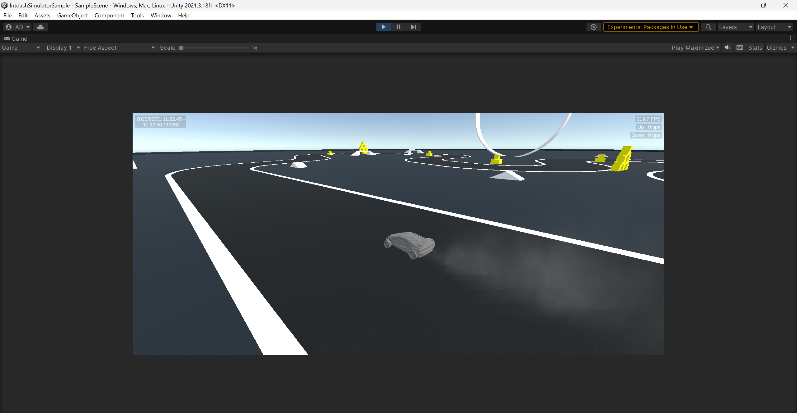
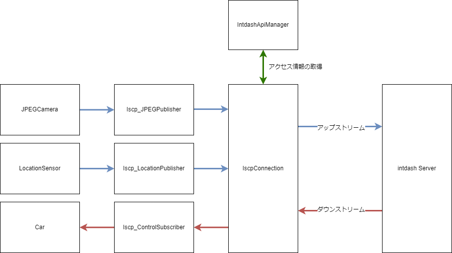
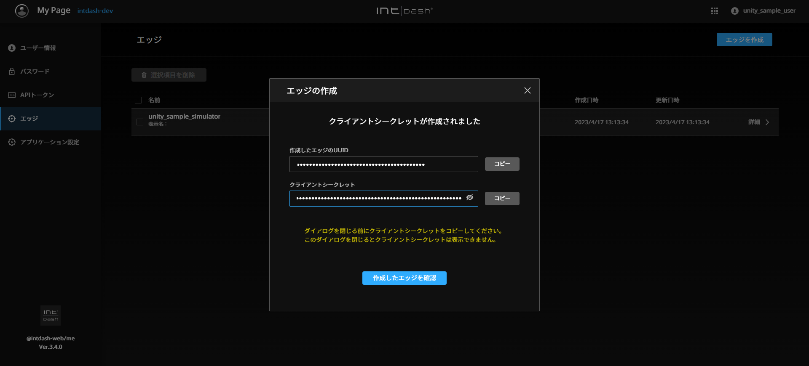
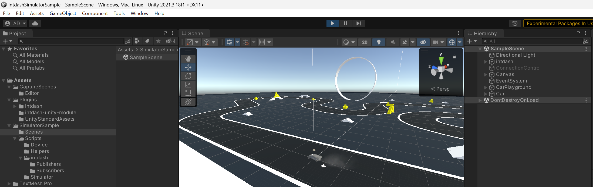
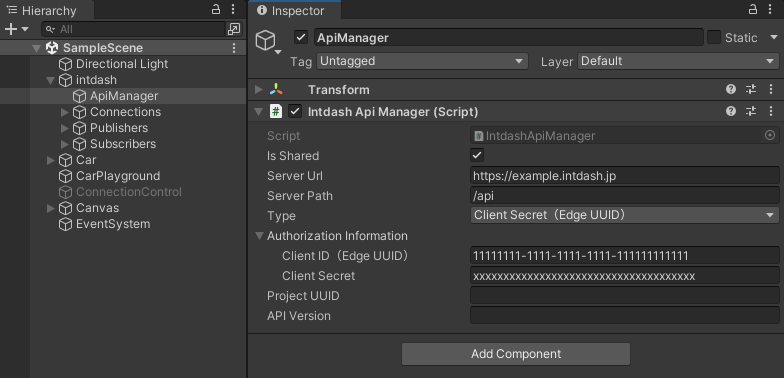
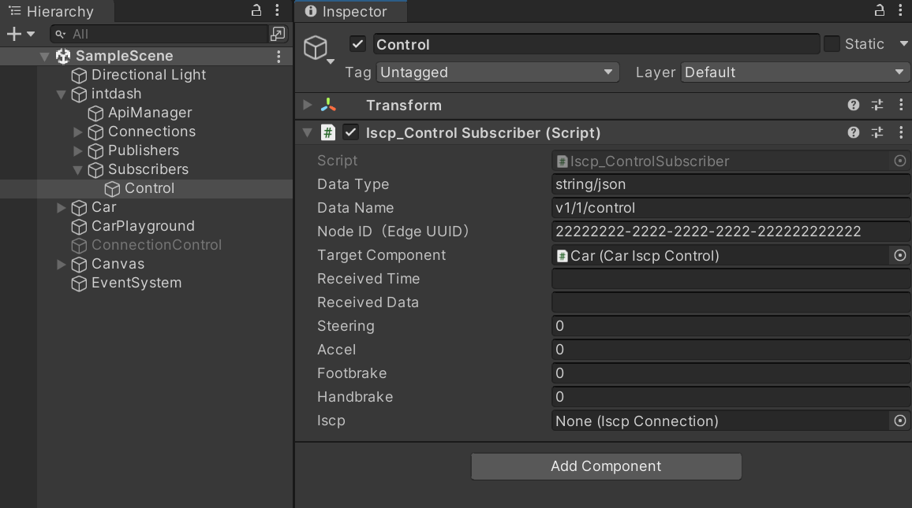
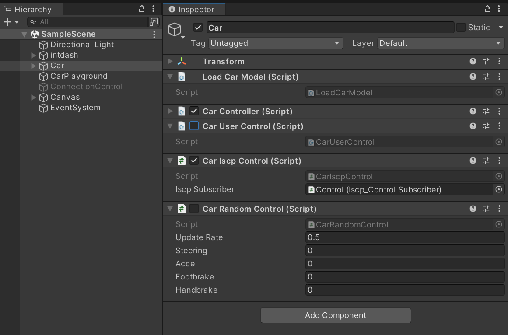
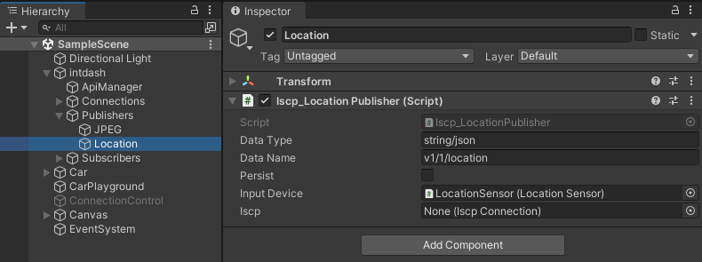

# intdash Simulator Sample

Unityでシミュレーション環境を作りintdashと連携させるサンプルです。

このサンプルは、車と走行空間のモデルを読み込み、シミュレーション空間内の車に設置されたカメラからの映像や車の位置情報をintdashサーバーに送信します。

また、intdashサーバーから車のコントロール情報も受信します。コントロール情報を受信すると、空間に設置された車が動きます。

コントロール情報の送信方法に関しては [IntdashControllerSample](../IntdashControllerSample/README.md) を参照してください。

このサンプルのデータフローは以下のとおりです。

## サンプルの動かし方

### 1. intdashサーバーとアクセス情報を用意する

- 接続先intdashサーバーのURL（例: https://example.intdash.jp ）
- Simulator内の車オブジェクトに設定するエッジの認証情報
    - UUID（例: 11111111-1111-1111-1111-111111111111）
    - クライアントシークレット または APIトークン
- ControllerのエッジUUID（例: 22222222-2222-2222-2222-222222222222）

サーバーとの接続にはクライアントシークレットまたはAPIトークンが必要です。

このサンプルではクライアントシークレットを利用します。

クライアントシークレットは、My Pageアプリ（例: `https://example.intdash.jp/users/me/`）の `エッジ` 画面でエッジを作成した際に発行されます。

詳細は [intdash / Visual M2Mユーザーガイド](https://docs.intdash.jp/manual/user-guide/latest/ja/index.html) の [エッジアカウントを作成する](https://docs.intdash.jp/manual/user-guide/latest/ja/intdash-web-console-apps/my-page.html#create-edge-account) で確認してください。

※上記はMy Page v3.4.0でクライアントシークレットを作成した場合の画像です。

### 2. シーンをセットアップする

サンプルのシーンは `Assets/SimulatorSample/Scenes/SampleScene.unity` にあります。

#### 2.1. IntdashApiManagerの設定

Hierarchy内の `intdash/ApiManager` を `Inspector` で確認すると `IntdashApiManager` がアタッチされています。

IntdashApiManagerのオプションに [1.](#1-intdashサーバーとアクセス情報を用意する) で用意した情報を設定してください。

- Server URL: `接続先intdashサーバーのURL`
- Authorization Type: `Client Secret (Edge UUID)`
- Authorization Information
    - Client ID (Edge UUID): `車オブジェクトに設定するエッジのUUID`
    - Client Secret: `クライアントシークレット`

#### 2.3. コントロールデータの受信設定

Hierarchy内の `intdash/Subscribers/Control` を `Inspector` で確認すると `Iscp_ControlSubscriber` がアタッチされています。

オプションの `Node Id (Edge UUID)` に、 [1.](#1-intdashサーバーとアクセス情報を用意する) で用意した `ControllerのエッジUUID` を入力してください。

### 3. 車モデルを動かす

サンプルのシミュレーション空間に設置された車モデルを動かす方法は3つあります。

Hierarchyの `Car` モデルに 以下1, 2, 3のスクリプトがアタッチされていますので、スクリプト名の左にあるチェックボックスでオン／オフを切り替えて利用してください。

1. Car User Control
    - 本サンプルアプリで上でキー入力を受け付けて車を動かすスクリプト。
    - 操作方法
        - 前進: W
        - 後退: S
        - ハンドル操作: A or D
        - ブレーキ: Space
        - ハンドブレーキ: Shift
2. Car Iscp Control
    - intdash Controller Sampleから受信したコントロール情報で車を動かすスクリプト。
3. Car Random Control
    - 自動でランダムに車を動かすスクリプト。

## 実装

### データの送信

intdashサーバーへのデータの送信は、シミュレーション空間内でデータを作りだす `DeviceScript` と intdashサーバーに送信する `Publisher` で行っています。

サンプルは以下にあります。

- Script
    - DeviceScript
        - `Assets/SimulatorSample/Scripts/Device/JPEGCamera.cs`
        - `Assets/SimulatorSample/Scripts/Device/LocationSensor.cs`
    - Publisher
        - `Assets/SimualtorSample/Scripts/intdash/Publishers/Iscp_JPEGPublisher.cs`
        - `Assets/SimualtorSample/Scripts/intdash/Publishers/Iscp_LocationPublisher.cs`
- Hierarcy
    - DeviceScript
        - `Car/JPEGCamera`
        - `Car/LocationSensor`
    - Publisher
        - `intdash/Publishers/JPEG`
        - `intdash/Publishers/Location`

Publisherの設定には以下の3つがあります。

- Data Type
- Data Name
- Save To Server

データを送信する際に `Save To Server` をオンにするとintdashサーバーにデータが保存されます。

データ送信のための実装はシンプルです。

1. IscpConnectionを用意する。（Awake時に `IscpConnection.GetOrCreateSharedInstance` で取得するか、事前にInspectorでIscpConnectionをセットしておきます。）
2. IscpConnectionでアップストリームを登録（オープン）する。
3. DeviceScriptからデータを取得する、または取得するイベントを登録する。
4. データを取得したら、送信先が要求するデータフォーマットに則りペイロードを作成する。（※ 送信先のデータフォーマットに合わせて自由に作成可能）
5. 作成したペイロードを、用意しておいたアップストリームで送信する。

- [Iscp_LocationPublisher.cs](./Assets/SimulatorSample/Scripts/intdash/Publishers/Iscp_LocationPublisher.cs)
- [Iscp_JPEGPublisher.cs](./Assets/SimulatorSample/Scripts/intdash/Publishers/Iscp_JPEGPublisher.cs)

### データの受信

データの受信は `Subscriber` で行っています。

サンプルは以下にあります。

- Script
    - Subscriber
        - `Assets/SimualtorSample/Scripts/intdash/Subscribers/iSCP_ControlSubscriber.cs`
- Hierarcy
    - Subscriber
        - `intdash/Subscribers/Control`

データ受信のための実装はデータ送信より簡単です。

1. IscpConnectionを用意する。（Awake時に IscpConnection.GetOrCreateSharedInstance で取得するか、事前にInspectorでIscpConnectionをセットしておく。）
2. 受信に必要な情報を設定してダウンストリームを登録（オープン）する。
3. データ受信時にイベントが発生するので、受信したデータのペイロードから必要なデータを取り出す。
4. データを可視化（処理）する。

- [Iscp_ControlSubscriber.cs](./Assets/SimulatorSample/Scripts/intdash/Subscribers/Iscp_ControlSubscriber.cs)
