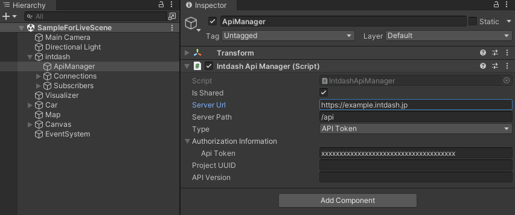

# intdash Visualizer Sample

intdashにデータストリーミングされたデータを可視化するサンプルです。

このサンプルでは、同梱されているintdash Simulator Sampleから送られてきたデータ（映像と位置情報）を可視化することが可能です。

リアルタイム再生と過去データ再生の2つの再生方法が実装されています。

- リアルタイム再生

リアルタイム再生時のデータフローは以下のとおりです。

- 過去データ再生

過去データ再生ではリアルタイム再生とは違い、走行したルートを右下のマップに可視化します。

過去データ再生時のデータフローは以下のとおりです。

## サンプルの動かし方

### 1. intdashサーバーとアクセス情報を用意する

- 接続先intdashサーバーのURL（例: https://example.intdash.jp ）
- Simulator内の車オブジェクトのエッジUUID（例: 11111111-1111-1111-1111-111111111111）
- 認証情報（APIトークン または クライアントシークレット）

サーバーとの接続にはクライアントシークレットまたはAPIトークンが必要です。

このサンプルではAPIトークンを利用します。

APIトークンは、My Pageアプリ（例: `https://example.intdash.jp/users/me/`）の `API トークン` 画面で作成可能です。

詳細は [intdash / Visual M2Mユーザーガイド](https://docs.intdash.jp/manual/user-guide/latest/ja/index.html) の [APIトークンを作成する](https://docs.intdash.jp/manual/user-guide/latest/ja/intdash-web-console-apps/my-page.html#api) で確認してください。

※上記はMy Page v3.4.0でAPIトークンを作成した場合の画像です。

### 2. シーンをセットアップする（リアルタイム再生）

リアルタイム再生のサンプルシーンは `Assets/VisualizerSample/Scenes/SampleForLiveScene.unity` にあります。

#### 2.1. IntdashApiManagerの設定

Hierarchy内の `intdash/ApiManager` を `Inspector` で確認すると `IntdashApiManager` がアタッチされています。

IntdashApiManagerのオプションに [1.](#1-intdashサーバーとアクセス情報を用意する) で用意した情報を設定してください。

- Server URL: `接続先intdashサーバーのURL`
- Authorization Type: `API Token`
- Authorization Information
    - Api Token: `APIトークン`

#### 2.2. 可視化データの受信設定

Hierarchyを確認すると以下のように `Subscriber` スクリプトがアタッチされています。

- Hierarchy
    - intdash
        - Subscribers
            - JPEG
                - `Iscp_JPEG Subscriber`
            - Location
                - `Iscp_Location Subscriber`

それぞれのオプションの `Node ID (Edge UUID)` に、 [1.](#1-intdashサーバーとアクセス情報を用意する) で用意した `Simulator内の車オブジェクトのエッジUUID` を入力してください。

### 3. シーンセットアップする(過去データの再生)

過去データ再生のサンプルシーンは `Assets/VisualizerSample/Scenes/SampleForPlaybackScene.unity` にあります。

#### 3.1. IntdashApiManagerの設定

[2.1.](#21-intdashapimanagerの設定) を参照してください。

#### 3.2. 可視化データの受信設定

Hierarchyを確認すると以下のように `Playback` スクリプトがアタッチされています。

- Hierarchy
    - intdash
        - Playbacks
            - JPEG
                - `Intdash_JPEG Playback`
            - Location
                - `Intdash_Location Playback`
            - Route
                - `Intdash_Route Playback`

それぞれのオプションに `Node ID (Edge UUID)` の項目があるので [1.](#1-intdashサーバーとアクセス情報を用意する) で用意した `Simulator内の車オブジェクトのエッジUUID` を入力してください。

#### 3.3 再生したい時間範囲を指定する

過去データを再生する場合は、再生したい時間範囲を指定する必要があります。

Hierarchy内 `Visualizer` というゲームオブジェクトに `Playback Visualizer` スクリプトがアタッチされていますので、そのオプションで `Start Time` 及び `End Time` を指定してください。

## 実装

### リアルタイム再生時のデータ受信

リアルタイム再生時のデータの受信は `Subscribe` で行っています。

サンプルは以下にあります。

- Script
    - Playbacks
        - `Assets/VisualizerSample/Scripts/intdash/Subscribers/Iscp_JPEGSubscriber.cs`
        - `Assets/VisualizerSample/Scripts/intdash/Subscribers/Iscp_LocationSubscriber.cs`
- Hierarchy
    - Subscribers
        - `intdash/Subscribers/JPEG`
        - `intdash/Subscribers/Location`

データ受信のフローは以下です。

1. IscpConnectionを用意する。（Awake時に IscpConnection.GetOrCreateSharedInstance で取得するか、事前にInspectorよりIscpConnectionをセットしておく。）
2. 受信に必要な情報を設定してダウンストリームを登録（オープン）する。
3. データ受信時にイベントが発生するので、受信したデータのペイロードから必要なデータを取り出す。
4. データを可視化する。

- [Iscp_LocationSubscriber.cs](./Assets/VisualizerSample/Scripts/intdash/Subscribers/Iscp_LocationSubscriber.cs)
- [Iscp_JPEGSubscriber.cs](./Assets/VisualizerSample/Scripts/intdash/Subscribers/Iscp_JPEGSubscriber.cs)

### 過去データ再生時のデータ受信

過去データの取得は `Playback` で行っています。

サンプルは以下にあります。

- Script
    - Playbacks
        - `Assets/VisualizerSample/Scripts/intdash/Playback/intdash_JPEGPlayback.cs`
        - `Assets/VisualizerSample/Scripts/intdash/Playback/intdash_LocationPlayback.cs`
        - `Assets/VisualizerSample/Scripts/intdash/Playback/intdash_RoutePlayback.cs`
- Hierarchy
    - Playbacks
        - `intdash/Playbacks/JPEG`
        - `intdash/Playbacks/Location`
        - `intdash/Playbacks/Route`

データの受信には [IntdashPlaybackManagerSample.cs](./Assets/VisualizerSample/Scripts/intdash/Playback/IntdashPlaybackManagerSample.cs) に含まれるプレイバック設定を利用します。
- `IntdashPlaybackManagerSample.RegisterPartialPlaybackData()`
    - 再生時の経過時間に応じて部分的にデータを取得します。
    - 長い時間範囲（全データなど）のデータを必要としないケースに利用します。
    - サンプルでは、映像と位置情報の可視化に必要な分のデータのリクエストに利用しています。
    - 一度のリクエストで要求する時間範囲に関しては `IntdashPlaybackManagerSample.RequestBulkDataDuration` を参照してください。
- `IntdashPlaybackManagerSample.RegisterBulkPlaybackData()`
    - 再生開始時に全データをリクエストします。
    - データ全体を可視化するグラフ等の処理で利用します。
    - サンプルでは、走行したルートの可視化に必要なデータのリクエストに利用しています。

映像及び位置情報の可視化のフローは以下になります。

1. IntdashPlaybackManagerSampleを用意する。（Awake時に IntdashPlaybackManagerSample.GetOrCreateSharedInstance で取得するか、事前にInspectorでIntdashPlaybackManagerSampleをセットしておきます。）
2. 受信に必要な情報を元にデータのプレイバック設定を行う。
3. シーク時のイベントを登録する。
4. データをキャッシュする時間を設定する。
5. データを受信したら可視化に必要なデータをキャッシュする。
6. 再生時の経過時間に応じてキャッシュしたデータからデータを抜き出し可視化を行う。
7. シーク位置が変更されたら（最初に戻るなど）データ読み出し機能の位置も変更しておく。

- [intdash_LocationPlayback.cs](./Assets/VisualizerSample/Scripts/intdash/Playback/intdash_LocationPlayback.cs)

走行したルートの可視化のフローは以下になります。

1. IntdashPlaybackManagerSampleを用意する。（Awake時に IntdashPlaybackManagerSample.GetOrCreateSharedInstance で取得するか、事前にInspectorでIntdashPlaybackManagerSampleをセットしておきます。）
2. 受信に必要な情報を元にデータのプレイバック設定を行う。
3. データを受信したら受信したデータのペイロードから必要なデータを取り出し可視化する。

- [intdash_RoutePlayback.cs](./Assets/VisualizerSample/Scripts/intdash/Playback/intdash_RoutePlayback.cs)

