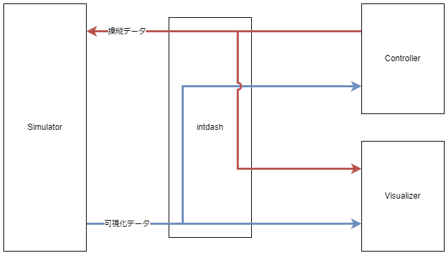

# intdash SDK Samples for Unity

intdashと連携したアプリケーションをUnityで開発する際のサンプルです。

## 全体構成

本リポジトリには、以下の3つのサンプルが含まれています。

[intdash Simulator Sample](./IntdashSimulatorSample/README.md): 物理シミュレーションのサンプル。シミュレーション空間からデータを取得してintdashサーバーへ送信します。

[intdash Controller Sample](./IntdashControllerSample/README.md): シミュレーション空間内のオブジェクトを遠隔操縦するコントローラのサンプル。

[intdash Visualizer Sample](./IntdashVisualizerSample/README.md): シミュレーション空間内のオブジェクトを遠隔可視化する可視化アプリケーションのサンプル。

3つのサンプル間のデータフローは以下のとおりです。



## 依存関係

- [iSCP Client for C#](https://github.com/aptpod/iscp-cs) (>= v0.11.0)
- [intdash REST API Client for C#](https://docs.intdash.jp/manual/api-sdk-docs-site/latest/ja/rest/rest-libraries.html) (>= v2.4.0)
- [intdash SDK for Unity](https://github.com/aptpod/intdash-unity) (>= v1.1.0)

## インストール方法

```
cd {YOUR_WORKSPACE}
git clone git@github.com:aptpod/intdash-unity-samples.git --recursive
```

一部の実装がサブモジュール化されています。 `git clone` する際に `--recursive` オプションを利用するなどしてインストールしてください。

